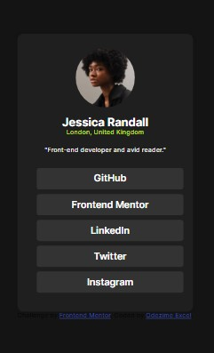

# Frontend Mentor - Social links profile solution

This is a solution to the [Social links profile challenge on Frontend Mentor](https://www.frontendmentor.io/challenges/social-links-profile-UG32l9m6dQ). Frontend Mentor challenges help you improve your coding skills by building realistic projects. 

## Table of contents

- [Overview](#overview)
  - [The challenge](#the-challenge)
  - [Screenshot](#screenshot)
  - [Links](#links)
- [My process](#my-process)
  - [Built with](#built-with)
  - [What I learned](#what-i-learned)
  - [Continued development](#continued-development)
- [Author](#author)

## Overview

### The challenge

Users should be able to:

- See hover and focus states for all interactive elements on the page

### Screenshot
  - Check Out My...
    
    

### Links

- Solution URL: [Add solution URL here](https://github.com/master-x2000/social-link)
- Live Site URL: [Add live site URL here](https://master-x2000.github.io/social-link/)

## My process

### Built with

- Semantic HTML5 markup
- CSS custom properties
- Flexbox

### What I learned
I was able to elaborate my knowledge on variable fonts with this challenge.

```css
@font-face {
    font-family: 'Inter';
    src: url(assets/fonts/Inter-VariableFont_slnt\,wght.ttf)
    format(ttf);
    font-display:swap;
    font-weight:100 900
}
```
### Continued development

I will definately be working on more variable fonts and how to use it better.


## Author

- Website - [Odezime Excel](https://master-x2000.github.io/social-link/)
- Frontend Mentor - [@Masterx-2000](https://www.frontendmentor.io/profile/masterx-2000)